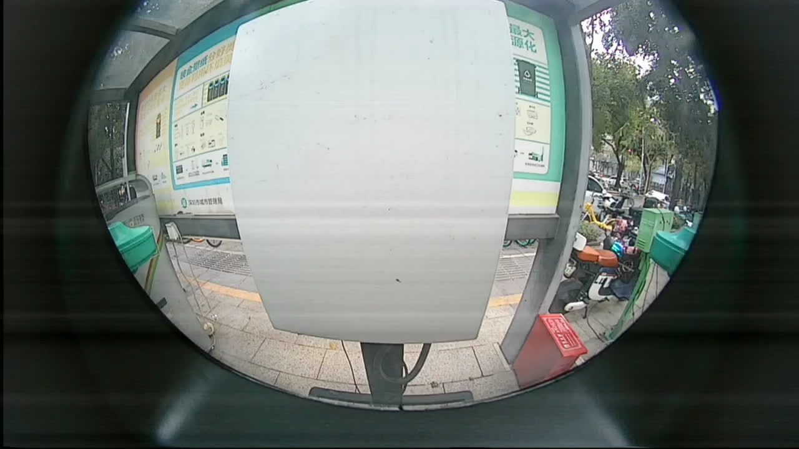
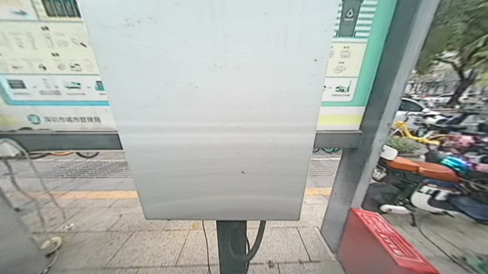

# 项目介绍

Lib_Undistort_Saturn是一个用于针孔模型摄像头和鱼眼模型摄像头的图像去畸变的C++动态库。

# 依赖项

Lib_Undistort_Saturn依赖于OpenCV，下载应用本库之前请先先下载OpenCV4.*

# 支持的摄像头

- 具有径向切向畸变的针孔摄像头
- 具有径向切向畸变的鱼眼摄像头

# 编译与安装

1. 安装依赖

   在使用该动态库之前，请确保你的系统已安装以下依赖：
   C++编译器（如GCC或Clang）
   OpenCV库（用于图像处理）

2. 编译动态库

   将源代码克隆到本地后，运行以下命令进行编译：

   ```bash
   mkdir build
   cd build
   cmake ..
   make
   ```

   编译完成后，你将在build目录下找到生成的动态库文件libundistort.so。

3. 示例代码

   以下是一个简单的示例代码，展示如何使用该动态库进行图像去畸变处理：

   ```c++
   #include <iostream>
   #include <chrono>
   #include <thread>
   #include "undistort.h"
   
   int main()
   {
       cv::Mat undistorted_image;
   
       std::string param_file = "../examples/camera_params.yml"; // 相机参数文件
   
       // 读取测试图像
       std::string image_path = "../examples/test_image.jpg";
       cv::Mat input_image = cv::imread(image_path);
       if (input_image.empty())
       {
           std::cerr << "Failed to load image: " << image_path << std::endl;
           return -1;
       }
   
       // 进行去畸变处理
       Undistort undistorter(param_file);
   
       for (size_t i = 0; i < 10000U; ++i)
       {
           auto start = std::chrono::high_resolution_clock::now();
           undistorted_image = undistorter.processFrame(input_image);
           auto end = std::chrono::high_resolution_clock::now();
           std::chrono::duration<double> elapsed = end - start;
           std::cout << "Undistortion took " << elapsed.count() << " seconds." << std::endl;
   
           std::this_thread::sleep_for(std::chrono::milliseconds(33));
       }
   
       // 显示结果
       cv::imshow("Original Image", input_image);
       cv::imshow("Undistorted Image", undistorted_image);
       cv::waitKey(0);
   
       return 0;
   }
   ```

4. 集成到项目

   将动态库文件libundistort.so和头文件undistort.h复制到你的项目目录中，并在项目中链接该动态库。

5. 参数说明

   camera_params_path是一个yaml配置文件的地址，该配置文件包含摄像头的内参矩阵和畸变系数以及图像的宽高，例如：

   ```yaml
   %YAML:1.0
   camera_matrix: !!opencv-matrix
       rows: 3
       cols: 3
       dt: d
       data: [ 311.5319594126301, 0.0, 643.6709427383354, 
               0.0, 310.684697261162, 344.96681732416835, 
               0.0, 0.0, 1.0 ]
   distortion_coefficients: !!opencv-matrix
       rows: 1
       cols: 4
       dt: d
       data: [ 0.06494872859950979, 0.0019246522662558574, 
               -0.012888995393555109, 0.002060082123840094 ]
   image_width: 1280
   image_height: 720
   ```

6. 示例图像

   以下是使用该动态库处理前后的图像对比：

   

   

7. 注意事项

   确保输入图像的畸变参数与实际相机一致，否则校正效果不佳。
   动态库仅支持单目相机畸变校正，双目相机需分别处理左右图像。

8. 贡献

   欢迎各位开发者通过提交Pull Request或Issue来帮助改进该项目。

9. 许可

   本项目采用MIT License。